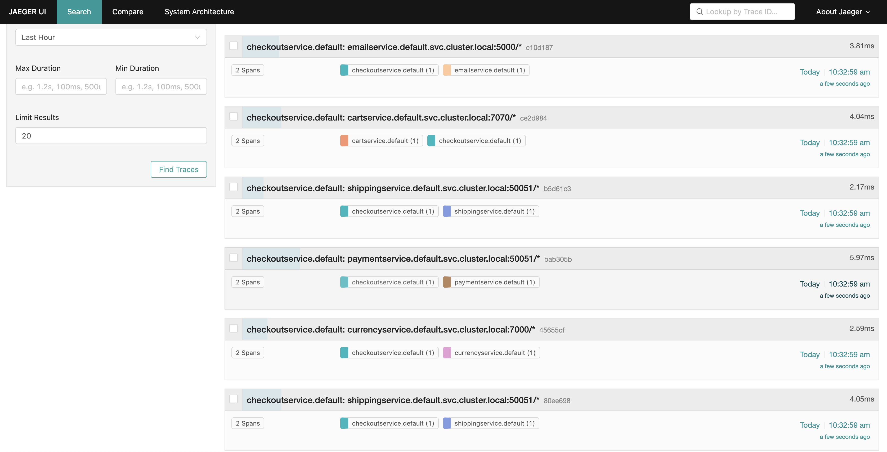

<p align="center">

</p>


**Online Boutique** is a cloud-native microservices demo application.
Online Boutique consists of a 11-tier microservices application. The application is a
web-based e-commerce app where users can browse items,
add them to the cart, and purchase them.

**Google uses this application to demonstrate use of technologies like
Kubernetes/GKE, Istio, Stackdriver, gRPC and OpenCensus**. This application
works on any Kubernetes cluster, as well as Google
Kubernetes Engine. It’s **easy to deploy with little to no configuration**.

**We will be using this repo to demonstrate Observability concepts in O & M workshop.**
Branch obs-exercise-1 can be used for completing Exercise 1 of the workshop.


## Screenshots

| Home Page                                                                                                         | Checkout Call Trace                                                                                                    |
| ----------------------------------------------------------------------------------------------------------------- | ------------------------------------------------------------------------------------------------------------------ |
| [](./docs/img/online-boutique-frontend-1.png) | [](./docs/img/jaeger-exercise-1.png) |

## Pre-requisites

1. GKE Cluster should be created. Optionally, istio can be setup. If istio has not been setup, please follow instructions to setup istio.

**Setup Istio**

- Follow the instructions at https://istio.io/latest/docs/setup/getting-started/#download to install istio. Please find below for reference.

```
curl -L https://istio.io/downloadIstio | sh -
cd istio-1.14.1
export PATH=$PWD/bin:$PATH
```

- Install Istio components with demo profile with sampling rate set to 100% and Jaeger service address

```
istioctl install --set profile=demo --set meshConfig.defaultConfig.tracing.sampling=100.00 --set meshConfig.defaultConfig.tracing.zipkin.address=zipkin.istio-system.svc.cluster.local:9411 -y
```

- Inject envoy proxies in application namespace

```kubectl label namespace default istio-injection=enabled```

- Re-create application deployments

```
kubectl delete --all deployments
kubectl apply -f ./release/kubernetes-manifests.yaml
kubectl apply -f ./release/istio-manifests.yaml
```

- After a few minutes, you should see application pods with istio sidecar proxies running
```
NAME                                                READY   STATUS     RESTARTS   AGE
adservice-6f498fc6c6-p67n5                          2/2     Running    0          45s
cartservice-bc9b949b-75wps                          2/2     Running    0          47s
checkoutservice-6fffd84787-77wlg                    2/2     Running    0          51s
currencyservice-6ddbdd4956-52m6s                    2/2     Running    0          47s
emailservice-68fc78478-jgpr5                        2/2     Running    0          52s
frontend-5bd77dd84b-crnsl                           2/2     Running    0          50s
paymentservice-584567958d-pfb96                     2/2     Running    0          48s
productcatalogservice-75f4877bf4-jzqqr              2/2     Running    0          48s
recommendationservice-646c88579b-jpmn2              2/2     Running    0          50s
redis-cart-5b569cd47-mrtkm                          2/2     Running    0          45s
shippingservice-79849ddf8-6v2gn                     2/2     Running    0          46s
```

- Get Ingress IP and access the application

```
INGRESS_HOST="$(kubectl -n istio-system get service istio-ingressgateway \
   -o jsonpath='{.status.loadBalancer.ingress[0].ip}')"
echo "$INGRESS_HOST"
```

## Setup Jaeger

- Deploy jaeger into cluster

Follow the instructions at https://istio.io/latest/docs/ops/integrations/jaeger/#installation for basic installation of jaeger components.

```
kubectl apply -f https://raw.githubusercontent.com/istio/istio/release-1.14/samples/addons/jaeger.yaml
```

- Recreate all deployments for application services to register with Jaeger

```
kubectl delete --all deployments
kubectl apply -f ./release/kubernetes-manifests.yaml
kubectl apply -f ./release/istio-manifests.yaml
```

- Start Jaeger dashboard and access services

```istioctl dashboard jaeger &```

You should see Jaeger service registered with all the application services

- See Checkout call trace

Access the application and do a checkout. See the corresponding trace in Jaeger dashboard.

The service calls from checkout service should be individual calls as in the below screenshot. In the next exercise, we will try to tie them together. Before that, we should be able to make changes to services. So, let us try and build checkout service locally.


## Building Service Locally

1. **Update service locally**

```
cd src/checkoutservice

# Enhance log statments in main.go file - main() function

log.Infof("Exercise 1 - Build service locally - service config: %+v", svc)
```

2. **Build Docker Image**

Build docker image in Cloud Shell Instance and deploy to your individual dockerhub accounts.

In your dockerhub account, create a new repository obs-checkout-service and make it public.

```
docker build -t suryasreevedula/obs-checkout-service:exercise-1 .
docker push suryasreevedula/obs-checkout-service:exercise-1
```

3.  **Update Deployment manifest**

Update release/kubernetes-manifests.yaml with the image name in checkoutservice Deployment

Example:
```
image: suryasreevedula/ob-checkout-service:1.0
```

4. **Deploy locally built service**

```
kubectl delete deploy checkoutservice
kubectl apply -f release/kubernetes-manifests.yaml
```

5. **Verify deployment**

Verify that locally built service is deployed

```kubectl logs $(kubectl get po -l app=checkoutservice -o name 2>/dev/null) 2>/dev/null```

The log should show as below

```{"message":"Exercise 1 - Build service locally - service config: \u0026{productCatalogSvcAddr:productcatalogservice:3550 cartSvcAddr:cartservice:7070 currencySvcAddr:currencyservice:7000 shippingSvcAddr:shippingservice:50051 emailSvcAddr:emailservice:5000 paymentSvcAddr:paymentservice:50051}","severity":"info","timestamp":"2022-07-24T07:24:09.787305782Z"}
{"message":"starting to listen on tcp: \"[::]:5050\"","severity":"info","timestamp":"2022-07-24T07:24:09.787788665Z"}```

## Architecture

**Online Boutique** is composed of 11 microservices written in different
languages that talk to each other over gRPC. See the [Development Principles](/docs/development-principles.md) doc for more information.

[](./docs/img/architecture-diagram.png)

Find **Protocol Buffers Descriptions** at the [`./pb` directory](./pb).

| Service                                              | Language      | Description                                                                                                                       |
| ---------------------------------------------------- | ------------- | --------------------------------------------------------------------------------------------------------------------------------- |
| [frontend](./src/frontend)                           | Go            | Exposes an HTTP server to serve the website. Does not require signup/login and generates session IDs for all users automatically. |
| [cartservice](./src/cartservice)                     | C#            | Stores the items in the user's shopping cart in Redis and retrieves it.                                                           |
| [productcatalogservice](./src/productcatalogservice) | Go            | Provides the list of products from a JSON file and ability to search products and get individual products.                        |
| [currencyservice](./src/currencyservice)             | Node.js       | Converts one money amount to another currency. Uses real values fetched from European Central Bank. It's the highest QPS service. |
| [paymentservice](./src/paymentservice)               | Node.js       | Charges the given credit card info (mock) with the given amount and returns a transaction ID.                                     |
| [shippingservice](./src/shippingservice)             | Go            | Gives shipping cost estimates based on the shopping cart. Ships items to the given address (mock)                                 |
| [emailservice](./src/emailservice)                   | Python        | Sends users an order confirmation email (mock).                                                                                   |
| [checkoutservice](./src/checkoutservice)             | Go            | Retrieves user cart, prepares order and orchestrates the payment, shipping and the email notification.                            |
| [recommendationservice](./src/recommendationservice) | Python        | Recommends other products based on what's given in the cart.                                                                      |
| [adservice](./src/adservice)                         | Java          | Provides text ads based on given context words.                                                                                   |
| [loadgenerator](./src/loadgenerator)                 | Python/Locust | Continuously sends requests imitating realistic user shopping flows to the frontend.                                              |

---

This is not an official Google project.
